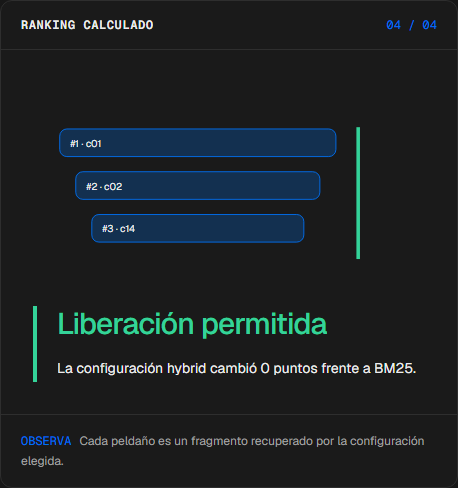
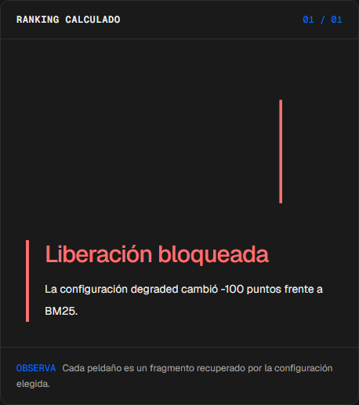
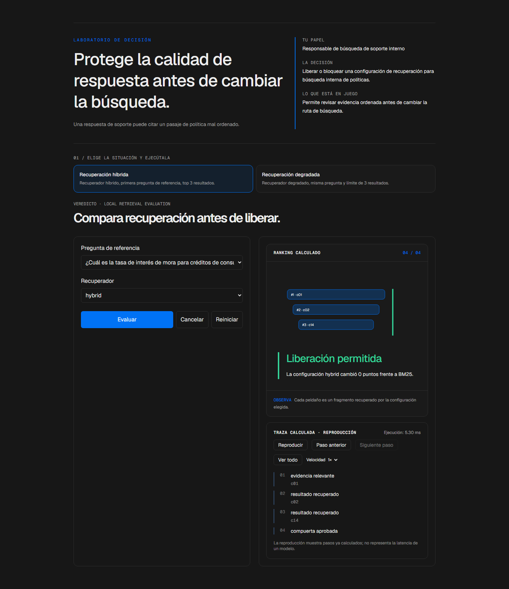

# Veredicto

<!-- community-badges -->
[](https://github.com/mdeasis27/veredicto/actions/workflows/ci.yml) [](LICENSE)
<!-- /community-badges -->

[English](README.md) · [Probar demo](https://veredicto-manueldeasis27-2515s-projects.vercel.app/es/app) · [Caso de estudio](https://portafolio-mdea.vercel.app/es/projects/veredicto) · [Código](https://github.com/mdeasis27/veredicto)


Compara configuraciones y subconjuntos de preguntas para inspeccionar rankings y controles de calidad.

## Dos situaciones para comparar

**Recuperación híbrida:** Recuperador híbrido, primera pregunta de referencia, top 3 resultados. Permanece disponible un resultado de política ordenado.



**Recuperación degradada:** Recuperador degradado, misma pregunta y límite de 3 resultados. La compuerta de recuperación bloquea la ruta.



## Caso de uso de negocio

Una respuesta de soporte puede citar un pasaje de política mal ordenado.

**Quién lo usa:** Responsable de búsqueda de soporte interno.

**La decisión:** Liberar o bloquear una configuración de recuperación para búsqueda interna de políticas.

Elige recuperación híbrida o degradada, ordena pasajes locales e inspecciona el resultado principal y la compuerta.

### Prueba la decisión

**Recuperación híbrida:** Recuperador híbrido, primera pregunta de referencia, top 3 resultados. Permanece disponible un resultado de política ordenado.

**Recuperación degradada:** Recuperador degradado, misma pregunta y límite de 3 resultados. La compuerta de recuperación bloquea la ruta.

Elige un escenario, modifica sus controles y ejecuta el cálculo local. Avanza por la visualización paso a paso o revela todo. Reinicia antes de comparar el segundo escenario.

## Cómo probarlo

Abre `/en/app` (inglés, por defecto) o `/es/app` (español). Cambia los datos del escenario y ejecuta el cálculo. Inspecciona la decisión, evidencia y traza calculada. La reproducción revela pasos locales ya completados; no mide un modelo en vivo. Reiniciar empieza un escenario local nuevo. Cambiar de idioma reinicia el escenario.

La demo principal no requiere cuenta, clave de API ni base de datos. Los enlaces públicos apuntan al despliegue existente; el rediseño local está pendiente de publicación.

<!-- recruiter-mission:start -->
### Tu misión interactiva

Carga recuperación vacía, inspecciona la misma pregunta y límite top 3, predice opcionalmente la compuerta local y revela la comparación final.

La recuperación elegida y la referencia BM25 usan la misma pregunta, corpus y k. Precisión divide los espacios relevantes recuperados entre k; recall divide relevantes recuperados entre el conjunto relevante etiquetado. La recuperación degradada es un control negativo explícitamente vacío. Los empates se conservan. La compuerta local exige además recall de al menos 0.5; sin etiquetas relevantes, el resultado no es evaluable y nunca aprueba.

**Por qué este enfoque:** BM25, TF-IDF y fusión locales hacen inspeccionable el cálculo sin credenciales. Una compuerta de una pregunta no certifica un lanzamiento; la calibración existente es referencia, no evidencia de esta ejecución.

**Antes de producción:** Evaluar preguntas representativas etiquetadas, regresiones por segmento, calidad de citas, privacidad y latencia real antes de liberar cambios.

Editar datos, elegir un escenario o reiniciar borra la predicción y los resultados anteriores. La comparación aparece al completar la reproducción; las demos principales no requieren cuenta ni llave.

Este lote modifica la implementación. Las capturas e informes de navegador existentes documentan la etapa anterior. Capturas nuevas, interacción, móvil y rutas HTTP siguen pendientes por los bloqueos documentados. La aprobación visual previa cubre el piloto anterior de seis misiones, no este lote.
<!-- recruiter-mission:end -->

## Instalación y verificación local

Requiere Node.js 22 y pnpm 10.

```sh
pnpm install --frozen-lockfile
pnpm dev
pnpm test
node node_modules/typescript/bin/tsc --noEmit --incremental false
pnpm lint
pnpm build
```

Abre `http://localhost:3000/en/app`. La validación registrada cubre pruebas, lint, TypeScript y builds de producción. Consulta los [resultados de comandos](docs/quality/decision-lab-verification.json) y las [comprobaciones de componentes en navegador](docs/quality/decision-lab-browser.json). Estas pruebas usan componentes React y CSS de producción con navegación de idioma controlada; no certifican rutas de Next ni el despliegue público.

## Arquitectura

- `app/[lang]/`: experiencia web por idioma.
- `lib/experience/`: adaptador local tipado, validación y trazas.
- `design-system/`: tokens visuales, controles de idioma y presentación de ejecución y reproducción.
- `app/api/`: integraciones opcionales de servidor; la demo principal no las requiere.

Tecnología: Next.js 16, TypeScript, Python, Vitest, pytest, scikit-learn (reference), Tailwind CSS v4.

## Evidencia y límites

Pasajes de política ordenados convergen en una compuerta de recuperación.

Rankings por pregunta y calibración sobre un corpus local explícito.

Permite revisar evidencia ordenada antes de cambiar la ruta de búsqueda.

**Límites:** Los rankings locales son ejemplos deterministas, no mediciones de relevancia con tráfico real de soporte. Estos prototipos de portafolio no afirman impacto medido en producción.

Los datos son ejemplos ficticios o anónimos. Las integraciones opcionales requieren sus propias credenciales y configuración. Los secretos pertenecen al gestor configurado, nunca a archivos locales de secretos ni Git. Usa el flujo existente `infisical run -- <command>` si necesitas integraciones en vivo. La demo local no publica ni despliega automáticamente.



<!-- community-section -->
## Licencia y contribución

Publicado bajo la [licencia MIT](LICENSE). Se aceptan issues y pull requests: lee antes [CONTRIBUTING.md](CONTRIBUTING.md) y el [Código de Conducta](CODE_OF_CONDUCT.md). Para reportar una vulnerabilidad, consulta [SECURITY.md](SECURITY.md).
<!-- /community-section -->
