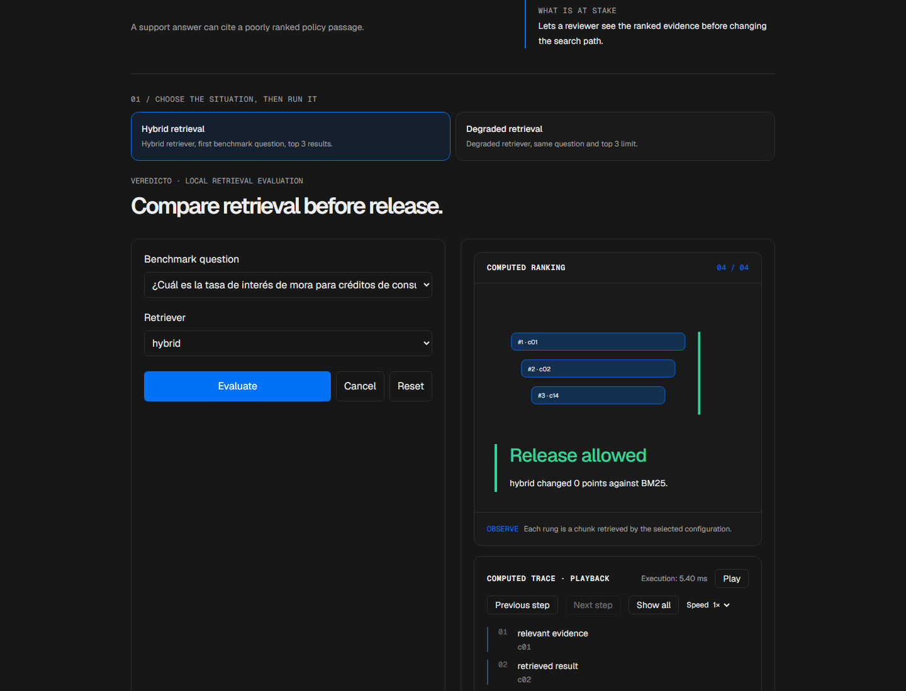
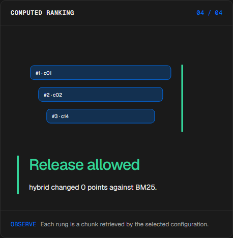
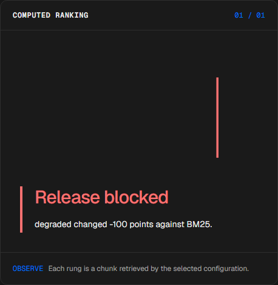
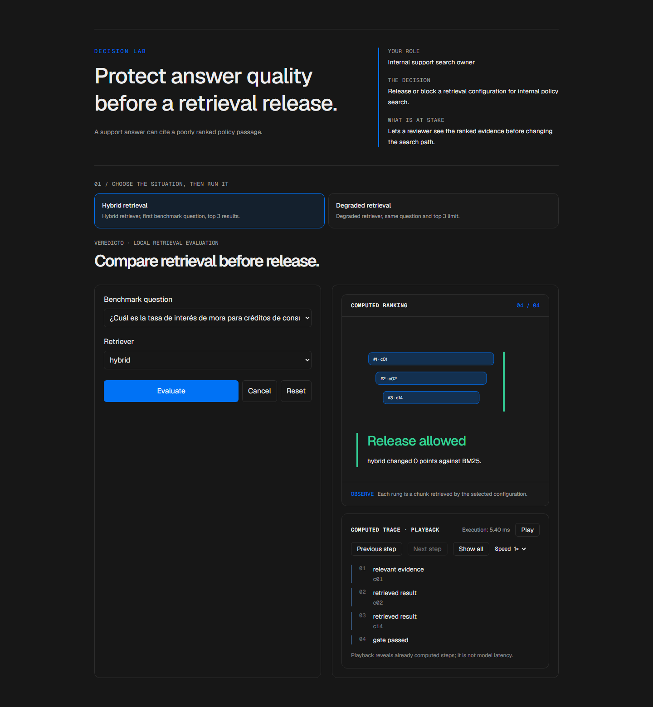

# Retrieval evaluation

<!-- community-badges -->
[](https://github.com/mdeasis27/veredicto/actions/workflows/ci.yml) [](LICENSE)
<!-- /community-badges -->

[Español](README.es.md) · [Try the demo](https://veredicto-manueldeasis27-2515s-projects.vercel.app/en/app) · [Case study](https://portafolio-mdea.vercel.app/en/projects/veredicto) · [Source](https://github.com/mdeasis27/veredicto)



Compare retrieval configurations and query subsets to inspect rankings and quality gates.

## Two situations to compare

**Hybrid retrieval:** Hybrid retriever, first benchmark question, top 3 results. A ranked policy result remains available.



**Degraded retrieval:** Degraded retriever, same question and top 3 limit. The retrieval gate blocks the path.



## Business use case

A support answer can cite a poorly ranked policy passage.

**Who uses it:** Internal support search owner.

**The decision:** Release or block a retrieval configuration for internal policy search.

Choose hybrid or degraded retrieval, rank local passages, inspect the top result and release gate.

### Try the decision

**Hybrid retrieval:** Hybrid retriever, first benchmark question, top 3 results. A ranked policy result remains available.

**Degraded retrieval:** Degraded retriever, same question and top 3 limit. The retrieval gate blocks the path.

Choose a scenario, edit its controls and run the local computation. Step through the visual process or reveal all steps. Reset before comparing the second scenario.

## How to try it

Open `/en/app` (English, default) or `/es/app` (Spanish). Change the scenario inputs and run the computation. Inspect the resulting decision, evidence and computed trace. Playback reveals completed local steps; it does not measure a live model. Reset starts a new local scenario. Changing language resets the scenario.

The primary demo needs no account, API key or database. Public links refer to the existing deployment; local redesign changes are pending publication.

<!-- recruiter-mission:start -->
### Your interactive mission

Load empty retrieval, inspect the same benchmark query and top-3 limit, optionally predict the local gate and reveal the terminal ranking comparison.

Selected retrieval and the BM25 reference use identical question, committed corpus and k. Precision counts relevant retrieved slots divided by k; recall divides relevant retrieved passages by the labeled relevant set. Degraded retrieval is an explicitly empty-ranking negative control. Equal outcomes remain equal. The local gate also requires recall of at least 0.5; no relevant labels means unscored, never approved.

**Why this approach:** Local BM25, TF-IDF and rank fusion make the calculation inspectable without credentials. A one-question gate is not a release certification; existing calibration is reference data rather than evidence of this execution.

**Before production:** Evaluate a representative labeled query set, segment regressions, citation quality, privacy and production latency before releasing retrieval changes.

Editing inputs, choosing a preset or resetting clears the prediction and obsolete results. Comparisons appear only at completed playback; the primary demos need no account or key.

This batch changes the implementation. Existing screenshots and browser reports document the previous stage. Fresh captures, browser interaction, mobile and HTTP verification remain pending under the documented tool denials. Prior owner visual approval covers the earlier six-mission pilot, not this batch.
<!-- recruiter-mission:end -->

## Local setup and verification

Requires Node.js 22 and pnpm 10.

```sh
pnpm install --frozen-lockfile
pnpm dev
pnpm test
node node_modules/typescript/bin/tsc --noEmit --incremental false
pnpm lint
pnpm build
```

Open `http://localhost:3000/en/app`. Recorded validation covers tests, lint, TypeScript and production builds. See [command results](docs/quality/decision-lab-verification.json) and [browser component checks](docs/quality/decision-lab-browser.json). The new browser checks exercise real React components and production CSS with controlled locale navigation; they do not certify Next routes or public deployment.

## Architecture

- `app/[lang]/`: localized browser experience.
- `lib/experience/`: typed local adapter, validation and run traces.
- `design-system/`: shared visual tokens, locale controls and execution/replay presentation.
- `app/api/`: optional server integrations; the primary demo does not require them.

Technology: Next.js 16, TypeScript, Python, Vitest, pytest, scikit-learn (reference), Tailwind CSS v4.

## Evidence and limitations

Ranked policy passages converge into a retrieval gate.

Per-query rankings and calibration over a disclosed local corpus.

Lets a reviewer see the ranked evidence before changing the search path.

**Limits:** Local rankings are deterministic examples, not relevance measurements from live support traffic. These portfolio prototypes do not claim measured production impact.

Inputs use fictional or anonymized examples. Optional live integrations require their own credentials and operational setup. Secrets belong in the configured secret manager, never in local secret files or Git. Use the existing `infisical run -- <command>` workflow when live integration is needed. This repository does not publish or deploy automatically as part of the local demo.



<!-- community-section -->
## License and contributing

Released under the [MIT License](LICENSE). Issues and pull requests are welcome: read [CONTRIBUTING.md](CONTRIBUTING.md) and the [Code of Conduct](CODE_OF_CONDUCT.md) first. To report a vulnerability, see [SECURITY.md](SECURITY.md).
<!-- /community-section -->
